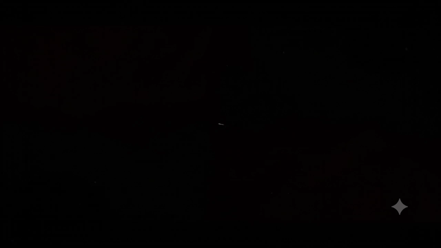
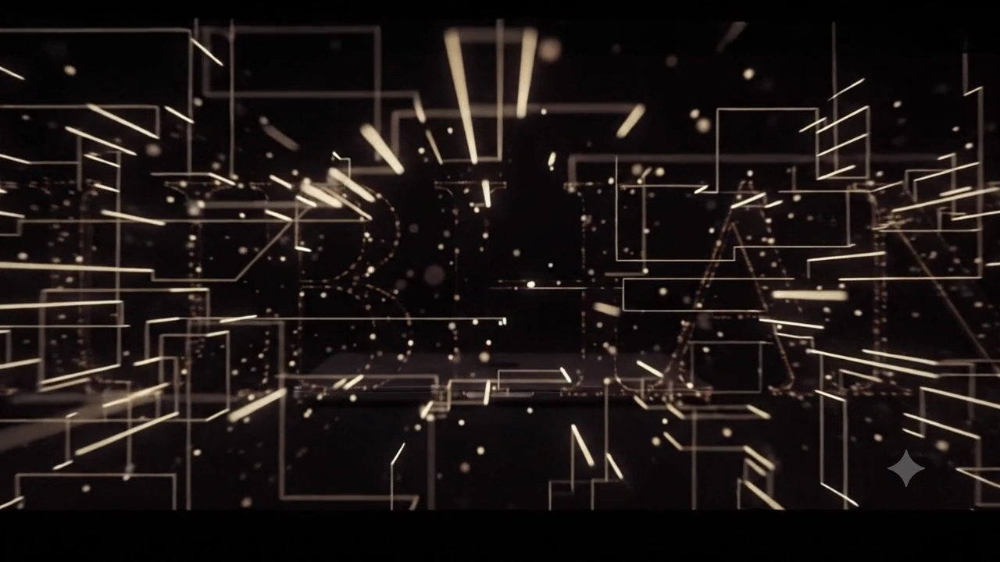
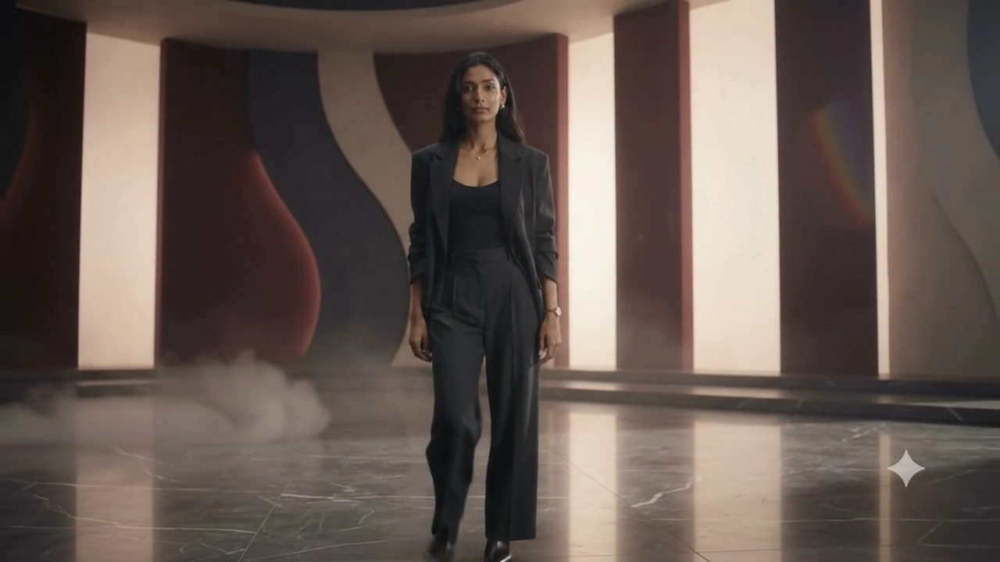

<div align="center">

# ✦ SHUBHANGI BIRADAR — DEVELOPER PORTFOLIO ✦

### *A Cinematic Scroll-Driven Web Experience with 3D Volumetric Particles & Laptop Screen Portal Transition*

[](https://github.com/Shubhangi2292/Portfolio)

<br/>

[](https://github.com/Shubhangi2292/Portfolio)
[](https://github.com/Shubhangi2292/Portfolio)
[](https://github.com/Shubhangi2292/Portfolio)
[](https://github.com/Shubhangi2292/Portfolio)
[](https://github.com/Shubhangi2292/Portfolio)
[](https://github.com/Shubhangi2292/Portfolio)

<br/>

[💻 Live Localhost Demo](http://localhost:5173/) • [📂 GitHub Repository](https://github.com/Shubhangi2292/Portfolio) • [📄 Download Resume](#-resume--curriculum-vitae)

</div>

---

## 🎬 Interactive Cinematic Scene Showcase

<details open>
<summary><b>▶ Click to Expand / Collapse Interactive Visual Sequence</b></summary>

<br/>

| 1. Digital Technology Space | 2. Laptop Screen Portal Transition | 3. Developer Persona Walking |
| :---: | :---: | :---: |
| [](public/preview-scene1-tech.png) | [](public/preview-scene2-portal.png) | [](public/preview-scene3-walking.png) |
| *Floating code nodes & tech environment* | *Camera dives into laptop screen portal* | *Developer walking sequence* |

</details>

---

## ✨ Architectural Highlights & Features

- **598-Frame Scroll-Driven Animation**: Seamlessly bridges two video sequences (Developer Portfolio Technology Animation $\rightarrow$ 3D Volumetric Particle Cloud $\rightarrow$ Person Walking Sequence).
- **Laptop Screen Portal Emergence Effect**: As the viewer scrolls, the camera flies into the laptop screen in the video, and the live interactive React portfolio website scales up and emerges directly out of the screen portal.
- **Dynamic 3D Particle Bridge Engine**: 650+ floating glowing particles (deep burgundy, warm gold, ivory) project into 3D camera space.
- **Unified Editorial Color Grade**: Real-time canvas post-processing pass with deep wine ambient lighting (`#9f123c`) and dark charcoal vignette.
- **100% Fully Responsive**: Adapts seamlessly to all viewports (320px mobile, 768px tablet, 1024px laptop, 4K desktop) with zero horizontal overflow (`overflow-x: hidden`).
- **Touch & Mobile Optimized**: Mobile menu drawer, touch-friendly tap targets, and Retina HiDPI DPR scaling.

---

## 🚀 Quick Start / Local Setup

### Prerequisites
- [Node.js](https://nodejs.org/) (v18+ recommended)
- `npm` or `yarn`

### Installation

```bash
# 1. Clone the repository
git clone https://github.com/Shubhangi2292/Portfolio.git

# 2. Navigate to project directory
cd Portfolio

# 3. Install dependencies
npm install

# 4. Start the Vite development server
npm run dev
```

Open **[http://localhost:5173/](http://localhost:5173/)** in your browser to view the live website.

---

## 🛠️ Tech Stack & Libraries

- **Frontend Core**: React 18, TypeScript, Vite
- **Styling**: Tailwind CSS v4, Custom CSS Animations
- **Icons**: Lucide React
- **Canvas Engine**: HTML5 2D Context, WebP Frame Preloader, RequestAnimationFrame Spring Lerp Physics

---

## 📂 Directory Structure

```
Portfolio/
├── public/
│   ├── frames/                    # 598 High-Quality WebP Animation Frames
│   ├── preview-animation.gif      # Interactive README Animated Preview
│   ├── preview-scene1-tech.png    # Scene 1 Snapshot
│   ├── preview-scene2-portal.png  # Laptop Portal Snapshot
│   └── preview-scene3-walking.png # Scene 2 Snapshot
├── src/
│   ├── components/
│   │   ├── CinematicIntro.tsx     # Canvas Scroll Animation Engine & 3D Particles
│   │   ├── Hero.tsx               # Hero Section & Editorial Typography
│   │   ├── Navbar.tsx             # Responsive Navigation & Mobile Drawer
│   │   ├── About.tsx              # Biographical Profile & Metrics
│   │   ├── Projects.tsx           # Verified Implementations Grid
│   │   ├── ProjectModal.tsx       # Project Details Overlay Modal
│   │   ├── TechnicalSkills.tsx    # Technical Skills Grid
│   │   ├── DevelopmentApproach.tsx# Software Methodology Cards
│   │   ├── Education.tsx          # Academic Qualifications Timeline
│   │   ├── Certifications.tsx     # Industry Credentials
│   │   ├── ResumeSection.tsx      # CV Section
│   │   ├── ResumeModal.tsx        # Interactive CV Modal & Printable PDF Export
│   │   ├── Contact.tsx            # Contact Form & Details
│   │   └── Footer.tsx             # Editorial Footer
│   ├── data/
│   │   └── portfolioData.ts       # Structured Portfolio Data & Content
│   ├── App.tsx                    # Main App Container & Portal Emergence Math
│   ├── main.tsx                   # React DOM Entry Point
│   └── index.css                  # Tailwind CSS Imports & Global Resets
├── index.html                     # HTML Template
├── package.json                   # Dependencies & Scripts
├── tsconfig.json                  # TypeScript Compiler Options
└── vite.config.ts                 # Vite Configuration
```

---

## 👤 Developer Profile

**Shubhangi Biradar**  
*Java & Software Developer*  
Computer Science & Technology Graduate • Presidency University, Bangalore  

---

<div align="center">

Made with ♥ by [Shubhangi Biradar](https://github.com/Shubhangi2292)

</div>
